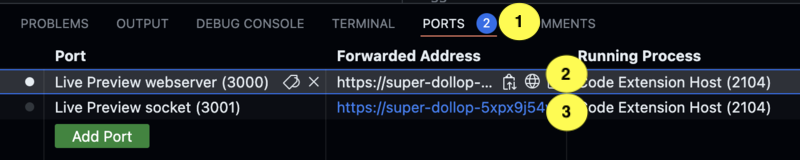
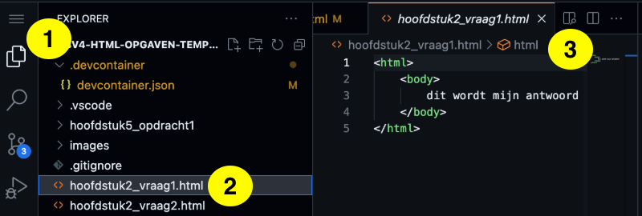

# Template voor Praktische Opdracht Webdesign

This repository is a template for Dutch students of ISW Hoogeland grades havo-4 and vwo-4 (highschool grade 10 in the US-system).
It contains startcode for an assigment to build a website. The recommended IDE for this template is Codespaces.

This template has been forked from Stanislascollege Westplantsoen.

## 1. Open een Codespace

Een Codespace is een online ontwikkelomgeving. Dat betekent dat je via een browser toegang krijgt tot een server. Op de server staat een kopie van jouw bestanden uit GitHub.

    - klik op groen knop "Code" (1)
    - klik op tabje "Codespaces" (2)
    - klik op "Create Codespace on main" (3)

Elk teamlid heeft een eigen Codespace, maar je deelt één GitHub repository je teamleden.
  

## 2. Maak een aanpassing aan je website

Je kunt nieuwe mappen en bestanden maken, kopieren een nieuwe naam geven of uploaden. Bestanden uploaden gebruik je voor plaatjes.

    - Voeg in het bestand index.html op de plek van de drie puntjes je favoriete kleur toe.
    

## 3. Bekijk het resultaat in een browser.

Omdat er een bug (foutje) in de preview-functie zit, moet je de volgende stappen doen voordat je de eerste preview opent

    - Klik op Ports (1)
    - Klik op de bovenste regel (port 3000) en vervolgens op het wereldbolletje dat verschijnt (2), er opent een nieuw tabblad, sluit het zojuist geopende tabblad
    - Klik op de bovenste regel (port 3001) en vervolgens op het wereldbolletje dat verschijnt (2), er opent een nieuw tabblad, sluit het zojuist geopende tabblad
    

    - Klik linksboven op het icoontje met de twee velletjes papier, zodat de explorer zichtbaar wordt. (1)
    - Klik op een .html bestand, het bestand wordt geopend (2)
    - Klik op het Show Preview icoon in de balk boven het bestand waarin ook de naam van het bestand staat, een preview wordt geopend (3)
    - Wijzigingen die je doet in het bestand worden direct in de preview zichtbaar
    

## 4. Bewaar je laatste versie in GitHub.

    - Klik op het icoontje met de twee streepjes en 3 bolletjes (1)
    - Type bij "Message" enkele woorden wat je gedaan hebt (2)
    - Klik op "Commit & Sync" (3)
  

## Informatie over GitHub met Codespaces

- https://stanislas.informatica.nu/help/codespaces/
