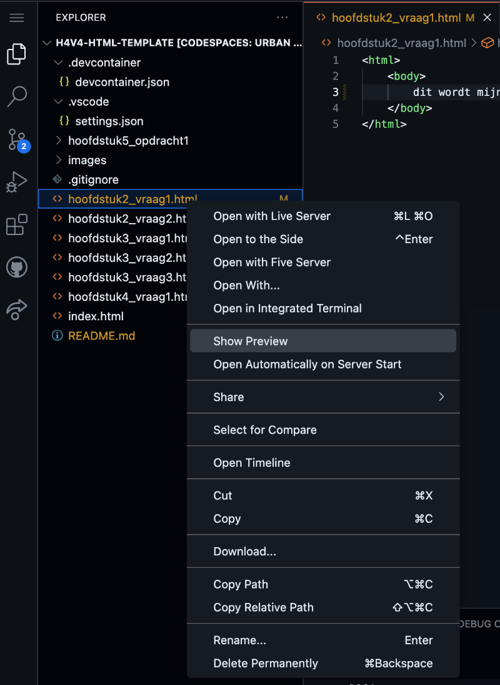

# Template voor Praktische Opdracht Webdesign

This repository is a template for Dutch students of Stanislascollege Westplantsoen grade havo-4 and vwo-4 (highschool grade 10 in the US-system).
It contains startcode for an assigment to build a website. The recommended IDE for this template is Codespaces.

## 1. Open een Codespace

Een Codespace is een online ontwikkelomgeving. Dat betekent dat je via een browser toegang krijgt tot een server. Op de server staat een kopie van jouw bestanden uit GitHub.

    - klik op groen knop "Code" (1)
    - klik op tabje "Codespaces" (2)
    - klik op "Create Codespace on main" (3)

Elk teamlid heeft een eigen Codespace, maar je deelt één GitHub repository je teamleden.
  

## 2. Maak een aanpassing aan je website

Je kunt nieuwe mappen en bestanden maken, kopieren een nieuwe naam geven of uploaden. Bestanden uploaden gebruik je voor plaatjes.

    - Voeg in het bestand index.html op de plek van de drie puntjes je favoriete kleur toe.
    

## 3. Bekijk het resultaat in een browser.

    - Klik linksboven op het icoontje met de twee velletjes papier, zodat de explorer zichtbaar wordt.
    - Klik met rechtermuisknop op een html-bestand, zodat een popup menu verschijnt
    - Klik op Show Preview in het popup menu. Een voorbeeldweegave met een foutmelding verschijnt in Codespace. Er verschijnt tegelijk en nieuw browser -window.
    - Sluit het browser-window en klik nog een keer op Show Preview. De foutmelding verdwijnt en je ziet een voorbeeldweergave van de html-pagina. Wijzigingen die je in het html-bestand maakt worden direct zichtbaar in de voorbeeldweergave. 
  

## 4. Bewaar je laatste versie in GitHub.

    - Klik op het icoontje met de twee streepjes en 3 bolletjes (1)
    - Type bij "Message" enkele woorden wat je gedaan hebt (2)
    - Klik op "Commit & Sync" (3)
  

## Informatie over GitHub met Codespaces

- https://stanislas.informatica.nu/help/codespaces/
